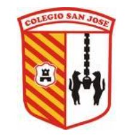

# **????? CURSO PREPARATORIO| SAN JOSE ?????**

## **?? INTRODUCCIÓN**

¡Hola ??! Bienvenid@ al Curso Preparatorio.

En este curso introductorio podrás aprender y practicar todo el contenido que necesitas para convertirte en un desarrollador de Java.

</br >

## **?? ¿QUÉ ES EL CURSO PREPARATORIO?**

Es un curso diseñado con la finalidad de nivelar a todos nuestros alumnos. Con este curso darás tus primeros pasos en el mundo de la tecnología y aprenderás esos conceptos básicos que son necesarios para poder realizar la carrera.

El curso consiste en una serie de videos, material teórico y ejercicios con los que podrás aprender nuestro lenguaje de desarrollo: Java. Puedes avanzar con el contenido a tu ritmo y de manera asincrónica (es decir, en los horarios y tiempos que tu prefieras).
</br >

## **?? ¿CÓMO AVANZAR EN ESTE PROCESO?**

Para avanzar debes seguir el material teórico junto con los videos que estan disponibles en el aula virtual. Para afianzar tus conocimientos y comenzar a practicar realiza cada una de estas **_Homeworks_**. Esto te facilitará resolver.

Cualquier duda, nos puedes escribir a gastonferreyra@colegiodesanjose.edu.ar

</br>

</br >

## **?? CLASES DE APOYO**

Para poder acompañarte en esta etapa te ofrecemos las **Clases de Apoyo en Vivo**. Este es un espacio donde los estudiantes se ponen a disposición para despejar todas las dudas que puedas tener mientras estás estudiando.

Cada día se establece una temática distinta a trabajar. Deberás llegar a la clase habiendo visto los videos sobre ese tema e intentado resolver los ejercicios, dado que en las clases no se explicará los temas desde cero sino que se resolverán dudas puntuales.


</br >

## **?? SUBE TUS AVANCES**

Te invitamos, cada vez que termines una homework, a que subas tus avances a tu repositorio. ¿Recordemos cómo hacer esto?

Deberás ejecutar estos comandos:

```bash
git add .
// Este comando te permitirá guardar tus cambios en Git.

git commmit -m "tuMensaje"
// Este comando te permitirá darle un título a tus cambios.

git push
// Este comando subirá tus cambios al repositorio de GitHub.
```

Recuerda que todos estos comandos son necesarios. Si tienes alguna duda, ¡te invitamos a que repases estos comandos en el Prep Course!

Encontrarás toda la explicación dentro de: "**`Módulo 2 | Creación de repositorio y primer commit`**".